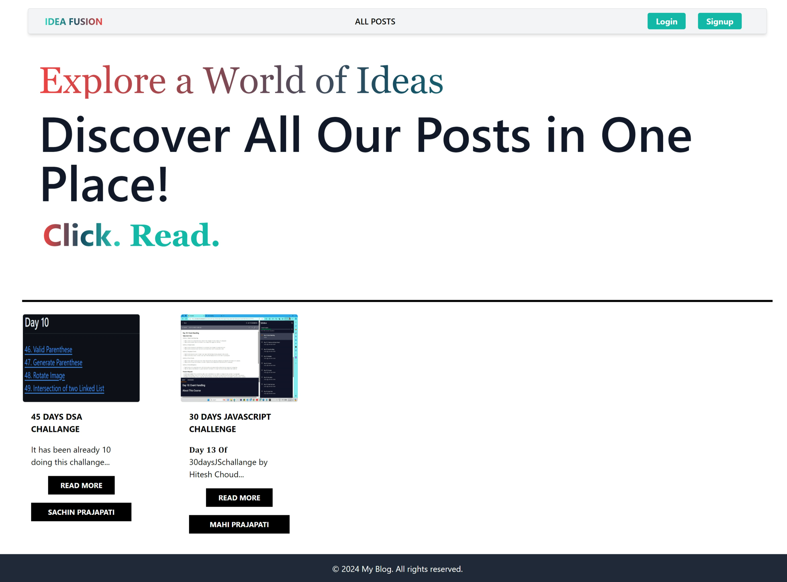
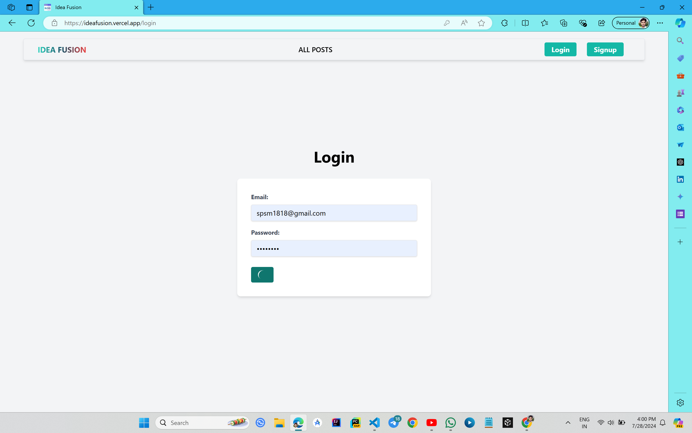
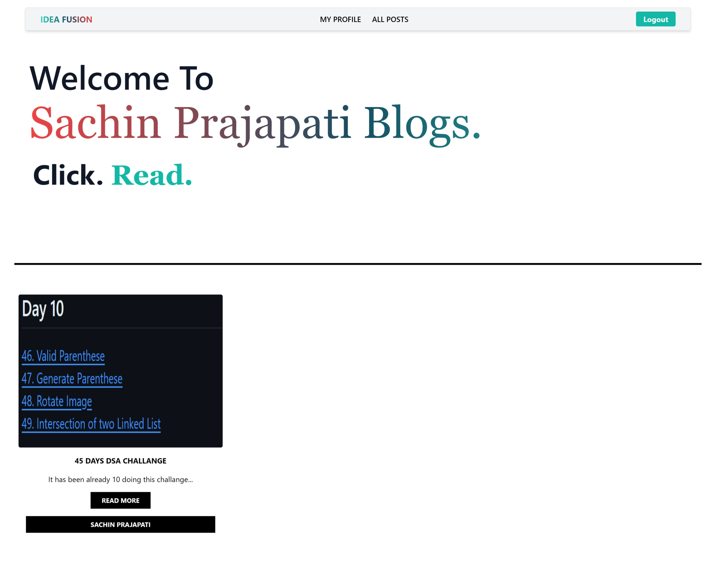

---

# IDEA FUSION Blog Application

A modern blog application built with React, Vite, Appwrite, and TailwindCSS. This application features a sleek user interface and powerful backend services for a seamless blogging experience. 



## Features

- **User Authentication**: Secure login and signup functionality.
- **Post Management**: Create, update, and delete blog posts.
- **User Profiles**: View and update user profiles.
- **Responsive Design**: Built with TailwindCSS for a mobile-friendly and modern design.
- **State Management**: Uses Redux for efficient state management.



## Tech Stack

- **Frontend**: React, Vite, TailwindCSS
- **Backend**: Appwrite (for authentication, database, and file storage)
- **State Management**: Redux

## Getting Started


### Installation

1. **Clone the repository:**

    ```bash
    git clone https://github.com/skp3214/IdeaFusion.git
    ```

2. **Navigate to the project directory:**

    ```bash
    cd IdeaFusion
    ```

3. **Install dependencies:**

    ```bash
    npm install
    ```

4. **Set up Appwrite:**
   - Create an Appwrite project.
   - Set up authentication, database, and file storage services.
   - Configure the Appwrite client in your project. Refer to the `.env` file for necessary environment variables.

5. **Run the development server:**

    ```bash
    npm run dev
    ```

6. **Open the application in your browser:**

    Navigate to `http://localhost:3000` (or the port specified in your Vite configuration).

## Configuration

1. **Environment Variables**

   Create a `.env` file in the root of the project and add the following variables:

    ```env
    VITE_APPWRITE_URL="https://cloud.appwrite.io/v1"
    VITE_APPWRITE_PROJECT_ID=""
    VITE_APPWRITE_DATABASE_ID=""
    VITE_APPWRITE_COLLECTION_ID=""
    VITE_APPWRITE_BUCKET_ID=""
    ```

2. **TailwindCSS Configuration**

   TailwindCSS is already configured. You can customize the styles by modifying the `tailwind.config.js` file.

## Usage

- **Login/Signup**: Navigate to the authentication pages to log in or sign up.
- **Post Management**: Create, update, or delete posts from the dashboard.
- **Profile Management**: View and update your profile information.

## Contributing

Feel free to fork the repository and submit pull requests. For major changes, please open an issue first to discuss what you would like to change.


## Acknowledgements

- **React**: For building the user interface.
- **Vite**: For fast build and development.
- **Appwrite**: For backend-as-a-service.
- **TailwindCSS**: For the beautiful and responsive design.
- **Redux**: For state management.

---

